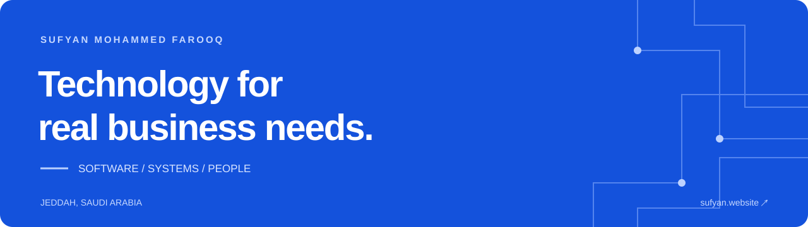
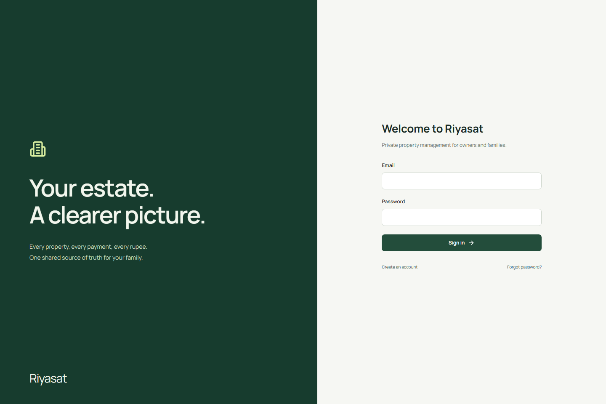
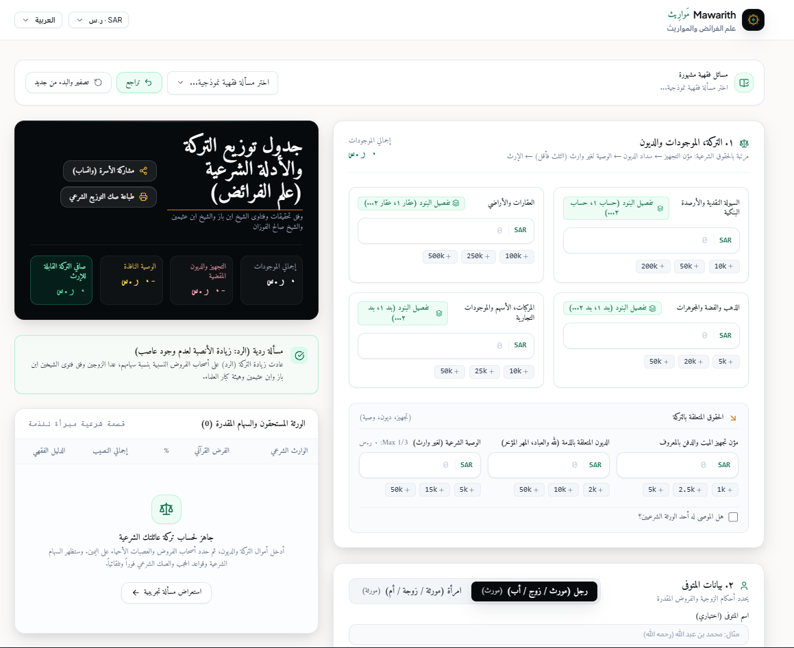

**[Portfolio](https://sufyanfarooq.com/) · [Email me](mailto:sufyanfarooqsmf@gmail.com) · [LinkedIn](https://www.linkedin.com/in/sufyan-farooq-077bbb264/)**

**Available immediately · Transferable iqama · Jeddah, Saudi Arabia · Open to relocation**

## Hello, I'm Sufyan

I build web applications and practical tools, with **3+ years of professional application support experience** at Digival IT Solutions. My work connects software, troubleshooting, and the people using it.

I'm **open to full-time opportunities** in web development, application support, technical implementation, and IT operations. I speak Arabic and English fluently and can join immediately.

## Selected work

<table>
  <tr>
    <td width="50%" valign="top">
      
      <h3><a href="https://github.com/Sufyan-Farooq/Riyasat">Riyasat</a></h3>
      
Property operations for owners and families. Rental agreements, payments, maintenance, financial reports, and role-based access.

      
<strong>Next.js · TypeScript · Supabase</strong>

      
<a href="https://riyasat.sufyanfarooq.com/">Open app</a> · <a href="https://github.com/Sufyan-Farooq/Riyasat">Explore source</a>

    </td>
    <td width="50%" valign="top">
      
      <h3><a href="https://github.com/Sufyan-Farooq/Mawarith">Mawarith</a></h3>
      
An inheritance calculator with a typed calculation engine, estate and heir inputs, multilingual UI, and calculation test cases.

      
<strong>React · TypeScript · Arabic UI</strong>

      
<a href="https://mawarith.sufyanfarooq.com/">Open beta</a> · <a href="https://github.com/Sufyan-Farooq/Mawarith">Explore source</a>

    </td>
  </tr>
</table>

**[Omer Global LLC](https://omergloballlc.com/)** — Paid client website for a Jeddah-based manpower supply and contracting business, presenting services and contact options.

**[KSA Jobs](https://github.com/Sufyan-Farooq/ksajobs)** — Personal recruitment-platform project combining a Next.js portal, job ingestion, and moderation workflows.

**[NAQL](https://naqlapp.com/)** — A website presenting a Saudi freight and customs-clearance platform.

## Professional background

**Onsite Support Engineer → Senior Onsite Support Engineer · Digival IT Solutions**

- Supported university learning platforms serving 2,000+ users.
- Investigated application and authentication issues using Postman, browser tools, and reproducible bug reports.
- Coordinated developer escalations, UAT, user onboarding, and Arabic/English documentation.
- Progressed to a senior role and supervised one support colleague.

I am now seeking a full-time role where I can contribute to software delivery and user support.

## Tools I use

**Development:** React, Next.js, TypeScript, JavaScript, Node.js, PostgreSQL, MongoDB, Git.

**Support & implementation:** REST APIs, Postman, UAT, incident troubleshooting, documentation, user training.

**Deployment projects & training:** Linux, AWS, Docker, Kubernetes, Terraform, GitHub Actions, Prometheus, Grafana.

**Education:** Bachelor of Computer Applications (BCA), Osmania University. Master of Business Administration (MBA), in progress — final year.

<strong>Personal projects & experiments</strong>

### [TurnUp.io](https://turnup.sufyanfarooq.com/)

A hobby multiplayer board-game platform exploring React/TypeScript, Node.js, Socket.io, PostgreSQL, authentication, and container deployment.

Temporarily unavailable while bugs are being fixed. [View source](https://github.com/Sufyan-Farooq/TurnUp.io).

**Transport Management System** — In development: dispatch, consignment manifests, driver assignments, and billing using React, Node.js, and PostgreSQL.

**Basil Bot** — A Discord game bot with team mechanics and persistent inventory.

**Dar Al-Hadith Portal** — Academic report-card lookup, certificate image generation, and term-mark analytics.

**AI & Systems Defense Lab** — Security exploration and defensive automation.

---

**Hiring for your team?** [Email me about the role](mailto:sufyanfarooqsmf@gmail.com?subject=Employment%20opportunity) or explore my [portfolio](https://sufyanfarooq.com/).
